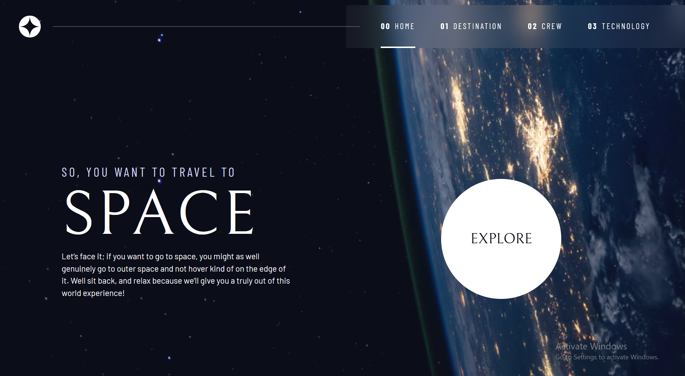

# Spacey - Frontend Mentor's Space tourism website solution

This is a solution to the [Space tourism website challenge on Frontend Mentor](https://www.frontendmentor.io/challenges/space-tourism-multipage-website-gRWj1URZ3). 

## Table of contents

- [Overview](#overview)
  - [The challenge](#the-challenge)
  - [Screenshot](#screenshot)
  - [Links](#links)
- [My process](#my-process)
  - [Built with](#built-with)
  - [Useful resources](#useful-resources)
- [Author](#author)

## Overview

### The challenge

Users should be able to:

- View the optimal layout for each of the website's pages depending on their device's screen size
- See hover states for all interactive elements on the page
- View each page and be able to toggle between the tabs to see new information

### Screenshot

### Links

- Live site URL: [Spacey](spacenerds.vercel.app)
- Solution URL: [Github repo](https://github.com/gaga4l/Spacey)

## My process

### Built with

- Semantic HTML5 markup
- CSS custom properties
- Flexbox
- CSS Grid
- Mobile-first workflow

### Useful resources

- [Frontend mentor](https://www.frontendmentor.io/)

## Author

- Github - [Gaga](https://github.com/gaga4l)
- Linkedin - [Gaga](https://www.linkedin.com/in/gaga4l?utm_source=share&utm_campaign=share_via&utm_content=profile&utm_medium=android_app)
- Twitter - [Gaga](https://www.twitter.com/lelisa_8)

